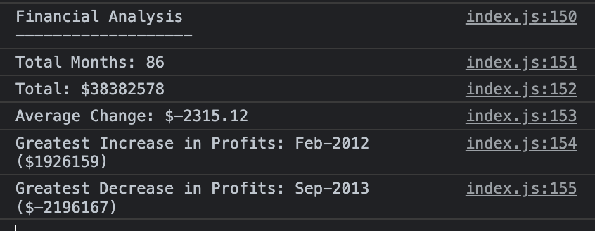

# Console-Finances

## Purpose

To analyze the financial records of a company using javascript and print an analysis in console

## Installation

N/A

## Usage
Open index.html and look at the console for the analysis, which includes - total no. of months, net total, average change, greatest increase and decrease in profit.   

## Credits

N/A

## License 

Please refer to the LICENSE in the repo.

## Screenshot

## Link

https://ngwingyan.github.io/Console-Finances/

